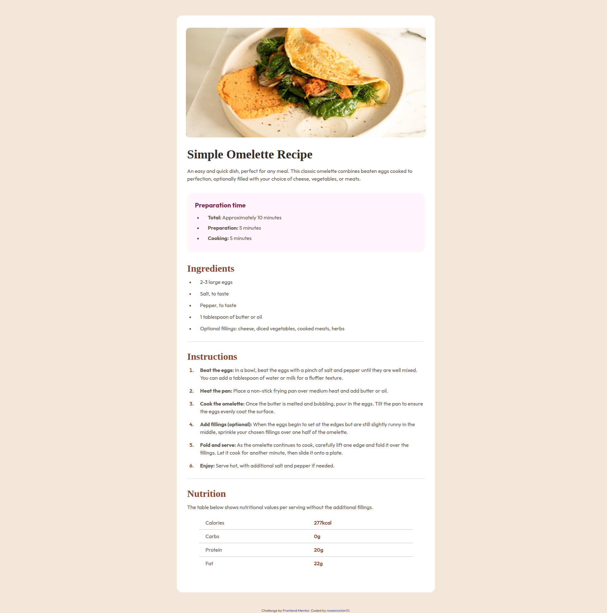

# Frontend Mentor - Recipe page solution

## Table of contents

- [Frontend Mentor - Recipe page solution](#frontend-mentor---recipe-page-solution)
  - [Table of contents](#table-of-contents)
  - [Overview](#overview)
    - [Screenshot](#screenshot)
    - [Links](#links)
  - [My process](#my-process)
    - [Built with](#built-with)
    - [What I learned](#what-i-learned)
    - [Continued development](#continued-development)
  - [Author](#author)

---

## Overview

This is my solution to the [Recipe page challenge on Frontend Mentor](https://www.frontendmentor.io/challenges/recipe-page-KiTsR8QQKm). Frontend Mentor challenges help you improve your coding skills by building realistic projects. This challenge is from the first section of their _Learning Path_. It is built with `HTML` for structuring the page, and `Tailwind` for designing. I followed the mobile-first approach for this project and learned a lot with making the page responsive and fluid.

### Screenshot

### Links

- [Solution in my Frontend Mentor Profile](https://www.frontendmentor.io/solutions/responsive-recipe-page-using-tailwind-css-EEZlW4BivX)
- [Live Demo](https://rowanvictor01-recipe-page.netlify.app/)

---

## My process

I first structured the page, the card, and the items inside the card like text, image, table. After that, I proceeded with applying the design with a mobile-first approach. I made sure everything looked nice starting on a screen size of 375px then worked my way up there by setting up breakpoints and using the `clamp()` function to make the style fluid.

### Built with

- Semantic HTML5 markup
- Tailwind CSS
- CSS custom properties
- Flexbox
- Mobile-first workflow

### What I learned

I learned the mobile-first approach by applying it on this project and making the design fluid and responsive by using `min` and `clamp()`.

### Continued development

I'll continue on working with the mobile-first approach and making sure the design is responsive and works on all screens.

---

## Author

- Frontend Mentor - [@rowanvictor01](https://www.frontendmentor.io/profile/rowanvictor01)
- X / Twitter - [@rowanlearnscode](https://www.x.com/rowanlearnscode)
